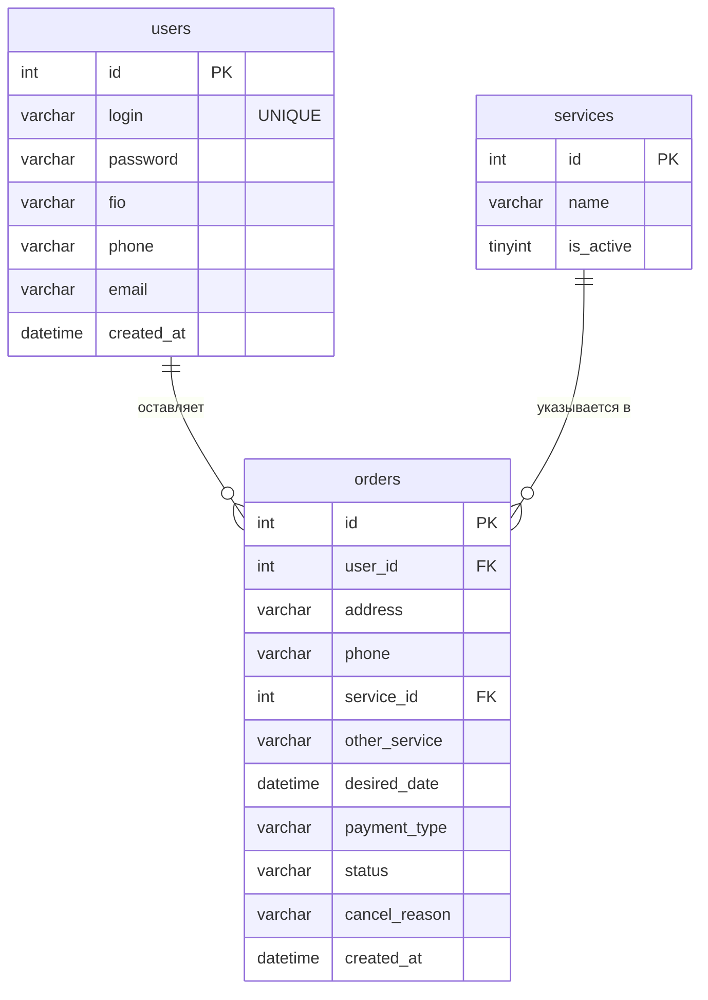

# ER-диаграмма базы данных (Модуль 3)

Модуль 3 требует «диаграмму базы данных с помощью средств графических редакторов».

**Готовые файлы диаграммы лежат рядом:**
- `ER.png` — растровое изображение (можно сразу сдавать/вставлять в отчёт).
- `ER.svg` — векторный вариант (открой в браузере или Inkscape, экспортируй в PNG любого размера).

Ниже — та же схема в формате **Mermaid** (для правки), текстовое описание связей и
заметка про ERwin.

## Связи
- **users 1 — ∞ orders**: один пользователь оставляет много заявок (`orders.user_id → users.id`).
- **services 1 — ∞ orders**: одна услуга встречается во многих заявках (`orders.service_id → services.id`). Связь необязательная: если выбрана «Иная услуга», `service_id = NULL`, а текст лежит в `other_service`.

## Как сдать диаграмму
Самый быстрый путь — уже готовые `ER.png` / `ER.svg`. Если нужен свой вариант:
1. Открой https://app.diagrams.net (draw.io) — работает без регистрации.
2. Нарисуй три прямоугольника-таблицы как выше, проведи связи «один-ко-многим».
3. Экспортируй: File → Export as → PNG → сохрани как `docs/ER.png`.

## Если на экзамене требуют именно ERwin
Родной формат ERwin (`.erwin`/`.er1`) — закрытый бинарный, его нельзя подготовить
заранее текстом, только в самой программе ERwin. НО есть быстрый способ — ERwin
сам построит модель из SQL-скрипта (**обратное проектирование / Reverse Engineer**).

### Способ А (быстрый) — построить модель из готового файла
В репозитории лежит специальный ASCII-файл: **`sql/erwin_reverse.sql`** (без кириллицы,
именно так, чтобы ERwin его прочитал — он импортирует только ANSI/ASCII-скрипты).
1. ERwin → **Actions → Reverse Engineer**.
2. New model type: **Logical/Physical**, Target DBMS: **MySQL** → Next.
3. Reverse Engineer From: **Script** → **Browse** → выбери `sql/erwin_reverse.sql` → Next/Finish.
4. ERwin сам нарисует `users`, `services`, `orders` со связями. Сохрани → получишь `.erwin`.

> Если модель получилась **пустой** — значит файл прочитался как Unicode. Открой
> `erwin_reverse.sql` в Блокноте → «Сохранить как» → кодировка **ANSI** → импортируй снова.
> Reverse Engineer работает только в **пустую** модель (не в ту, где уже есть таблицы).

### Способ Б (вручную, ~5 минут)
1. ERwin → New Model → Logical/Physical, СУБД: MySQL.
2. Создай 3 сущности `users`, `services`, `orders` с полями из схемы выше (PK — `id`).
3. Проведи связи: `users → orders` (1:M) и `services → orders` (1:M).
4. Сохрани модель — получишь `.erwin`-файл. Образец — `ER.png`.
